# DDD-Enforcer

## SRS-grounded Domain-Driven Design enforcement for Python

Turn requirements into a typed domain model. Detect architectural drift in VS Code. Trace each finding back to the source material.

[](https://github.com/barandincoguz/DDD-Enforcer/actions/workflows/backend-ci.yml)
[](https://github.com/barandincoguz/DDD-Enforcer/actions/workflows/extension.ci.yml)
[](https://www.python.org/)
[](https://code.visualstudio.com/)
[](https://ieeexplore.ieee.org/document/11418529)
[](https://doi.org/10.1109/IISEC69317.2026.11418529)

[Architecture](#architecture) · [Quick start](#quick-start) · [Published evaluation](#published-evaluation) · [Paper](https://ieeexplore.ieee.org/document/11418529)

---

DDD-Enforcer converts PDF, DOCX, and TXT software requirements into a structured DDD model, checks Python code against that model, and reports violations as VS Code diagnostics with suggestions and SRS references.

The project combines typed multi-stage LLM orchestration with deterministic verification, Python AST analysis, import-topology checks, and retrieval-augmented traceability. Its intermediate decisions remain inspectable through typed artifacts and stage boundaries.

## Published research

> **DDD-Enforcer: An AI-Powered Multi-Agent System for Real-Time Domain-Driven Design Enforcement**
>
> Ahmet Baran Dinçoğuz, Ali Kendir, and Murat Karakaya
>
> 5th International Conference on Informatics and Software Engineering, IISEC 2026
>
> Ankara, Türkiye, 5-6 February 2026, pp. 746-751

Read the paper on [IEEE Xplore](https://ieeexplore.ieee.org/document/11418529) or use the permanent [DOI link](https://doi.org/10.1109/IISEC69317.2026.11418529).

The paper reports the conference-evaluated system. Development continued after that study. The current `main` branch adds a typed Verifier and bounded Refiner, a strategic Context Mapper, a Holistic Critic loop, stronger AST/import-topology enrichment, and expanded run observability. The published measurements below do not benchmark those later components.

## Why it exists

Domain drift rarely starts with one obvious failure. It accumulates through renamed concepts, generic abstractions, undeclared dependencies, misplaced responsibilities, and code that no longer uses the language of the requirements.

Conventional linters understand syntax and types, but they do not know what `Customer`, `Order`, or a bounded-context boundary means in a specific project. An LLM can reason about that intent, but an unstructured review is hard to reproduce and audit.

DDD-Enforcer puts deterministic controls around probabilistic reasoning:

- SRS sentences become traceable evidence, not anonymous prompt text.
- Typed schemas constrain bounded contexts, entities, value objects, aggregates, services, events, and relationships.
- The Verifier checks invariants before the model is accepted.
- Bounded refinement routes findings back to the responsible stage.
- Python AST and import analysis ground the generated model in the actual codebase.
- Validation results return to the editor with suggested fixes and source references.

## Architecture



The system has two connected workflows.

### 1. Domain model generation

1. The defensive parser reads PDF, DOCX, or TXT requirements.
2. Scout preserves evidence boundaries and stable source references.
3. Architect identifies bounded contexts and their responsibilities.
4. Specialist extracts tactical DDD concepts.
5. Verifier and Refiner check typed invariants and run bounded corrections when needed.
6. Synthesizer produces the typed `DomainModel`.
7. Context Mapper derives strategic context relationships and allowed dependencies.
8. Holistic Critic evaluates the model as a whole, routes bounded feedback, and keeps the best result.
9. AST and import-topology enrichment connect the model to the Python workspace.
10. The result is persisted as `<workspace>/domain/model.json` and the SRS is indexed for retrieval.

Architect, Specialist, Context Mapper, and Holistic Critic are LLM-backed reasoning roles. The Verifier, Refiner control flow, AST enrichment, and RAG index provide deterministic or bounded support around them.

### 2. Validation on save

When a Python file is saved, the extension computes a semantic fingerprint and skips comment-only or whitespace-only changes. Relevant edits are sent to the local FastAPI backend, where DDD rules and AST signals are checked against `domain/model.json`. Advanced cases can use LLM analysis, while the RAG index retrieves supporting SRS passages. Findings return as diagnostics, hover details, suggestions, and source references.

## What is inside

| Area | Implementation |
| --- | --- |
| Requirements ingestion | Defensive PDF, DOCX, and TXT parsing with a 50 MiB default pre-parse limit |
| Model extraction | Scout, Architect, Specialist, Synthesizer |
| Quality control | Typed Verifier, bounded Refiner, Holistic Critic |
| Strategic DDD | Context Mapper and derived allowed dependencies |
| Code grounding | Python AST signals, import graph, mutability analysis, topology enrichment |
| Traceability | Chroma-backed RAG from violations to SRS evidence |
| Developer experience | TypeScript VS Code extension, diagnostics, hovers, status bar, source navigation |
| Backend | Local FastAPI service bound to `127.0.0.1` |
| Observability | Stage records, token and latency accounting, metrics, experiment tooling |
| Provider path | Gemini in the shipped extension flow; an Ollama-compatible adapter exists for research tooling |

## Quick start

### Prerequisites

- Python 3.12
- Node.js 20 or a newer LTS release
- VS Code 1.106.1 or newer
- A Gemini API key from [Google AI Studio](https://aistudio.google.com/)

### Install the backend dependencies

```bash
git clone https://github.com/barandincoguz/DDD-Enforcer.git
cd DDD-Enforcer/extension/backend

python3.12 -m venv .venv
source .venv/bin/activate
pip install -r requirements.txt
```

On Windows PowerShell, activate the environment with `.venv\Scripts\Activate.ps1`.

### Build the extension

Open a second terminal from the repository root:

```bash
cd extension
npm ci
npm run compile
npm run lint
```

Open the repository in VS Code and press `F5` to launch an Extension Development Host. The extension starts its local backend process using the configured `ddd-enforcer.pythonPath`, which defaults to `python3`.

Before the first launch, set **DDD Enforcer: Python Path** in VS Code to the absolute path of the environment created above:

- macOS/Linux: `<repository>/extension/backend/.venv/bin/python`
- Windows: `<repository>\extension\backend\.venv\Scripts\python.exe`

When prompted, enter the Gemini API key. The extension validates it, stores it in VS Code Secret Storage, selects an available loopback port, and starts one backend process automatically.

### Use it

1. Open a Python workspace in the Extension Development Host.
2. Run `DDD Enforcer: Initialize Domain Model` from the Command Palette.
3. Select one or more PDF, DOCX, or TXT requirements documents.
4. Inspect the generated `<workspace>/domain/model.json`.
5. Save a Python file or run `DDD Enforcer: Validate Current File`.
6. Review diagnostics and use the source reference to return to the relevant requirement.

The extension also exposes commands for status, backend restart, and run-manifest inspection.

## Example

Suppose the generated domain model defines `Customer` in `SalesContext` and marks `Client` as terminology to avoid:

```python
class ClientManager:
    pass
```

DDD-Enforcer can report the mismatch in VS Code with a suggested domain term and a reference to the SRS evidence that introduced `Customer`.

The same validation path also checks structural concerns such as context-boundary dependencies and advanced AST signals. Results are project-specific because they are evaluated against the generated domain model rather than a global style guide.

## Published evaluation

The IISEC 2026 paper reports these results for the conference-evaluated version and its experimental setup:

| Measure | Reported result |
| --- | ---: |
| Detection across evaluated cases | 100% across 15 cases |
| Average validation latency | 4.49 s |
| RAG Top-1 accuracy | 76.8% |
| RAG Top-3 accuracy | 88.8% |
| Average RAG retrieval latency | 140.52 ms |

These values should not be read as universal guarantees. The current repository contains pipeline components added after the conference evaluation.

## Engineering scope

The implementation spans:

- peer-reviewed applied software-engineering research;
- typed multi-stage LLM orchestration with bounded feedback;
- deterministic checks around probabilistic model output;
- Python AST analysis and architectural dependency rules;
- requirement-to-code traceability through RAG;
- a FastAPI backend integrated with a TypeScript VS Code extension;
- run metrics, token accounting, and research evaluation tooling.

## Verification

The repository has separate CI workflows for the Python backend and VS Code extension.

```bash
# Extension gates
cd extension
npm ci
npm run compile
npm run lint

# Backend gates
cd backend
python -m compileall .
pytest -m "not integration" --cov=. --cov-report=term --cov-fail-under=60

# Run from the repository root
cd ../..
pyright
```

The backend test suite covers schemas, orchestration, DDD verification rules, parser defenses, AST grounding, RAG behavior, Context Mapper, Holistic Critic routing, token tracking, metrics, and observability. Live API tests are marked as integration tests and require a running backend.

## Repository map

```text
DDD-Enforcer/
├── extension/
│   ├── src/                         # VS Code extension and tests
│   ├── backend/
│   │   ├── core/
│   │   │   ├── orchestration/       # Pipeline control flow and typed errors
│   │   │   ├── context_mapper/      # Strategic context relationships
│   │   │   ├── critic/              # Holistic critique and bounded routing
│   │   │   ├── verifier/            # Deterministic and semantic checks
│   │   │   ├── refiner/             # Bounded correction loop
│   │   │   ├── AST/                 # Code signals and import topology
│   │   │   ├── llm/                 # Provider clients and retry policy
│   │   │   └── observability/       # Run manifests and stage records
│   │   ├── configs/                  # Active model configuration
│   │   ├── tests/                    # Backend test suite
│   │   └── main.py                   # FastAPI entrypoint
│   └── package.json                  # Extension manifest and build scripts
├── docs/
│   ├── architecture.html             # Detailed interactive architecture sheet
│   └── assets/                        # README pipeline source and SVG
├── resources/                         # Research material and paper assets
└── .github/workflows/                 # Backend and extension CI
```

## Configuration notes

- `ddd-enforcer.validateOnSave` enables validation on Python save and defaults to `true`.
- `ddd-enforcer.backendPort` sets the preferred local port and defaults to `8000`.
- `ddd-enforcer.pythonPath` selects the Python executable and defaults to `python3`.
- `DDD_MAX_SRS_BYTES` changes the default 50 MiB document limit.
- `DDD_CONTEXT_MAP=0` disables the Context Mapper.
- `DDD_CRITIC_LOOP=0` disables the Holistic Critic loop.

The extension validates a Gemini key before use and can migrate prompted or legacy keys into VS Code SecretStorage.

## Scope and limitations

- Code validation currently targets Python.
- The shipped extension flow uses Gemini and requires network access during LLM-backed stages.
- The Ollama-compatible provider adapter belongs to internal and research tooling; provider selection is not exposed as an extension setting.
- Results depend on the quality and completeness of the supplied requirements.
- The project supports architectural review. It does not replace human design judgment or guarantee defect-free software.
- The VS Code extension is distributed under the [MIT License](extension/LICENSE). Research manuscripts and bundled research materials are not implicitly relicensed by that file.

## Citation

If DDD-Enforcer supports your research or engineering work, cite the published paper:

```bibtex
@inproceedings{dincoguz2026dddenforcer,
  author    = {Ahmet Baran Din\c{c}o\u{g}uz and Ali Kendir and Murat Karakaya},
  title     = {{DDD-Enforcer}: An AI-Powered Multi-Agent System for Real-Time Domain-Driven Design Enforcement},
  booktitle = {2026 5th International Conference on Informatics and Software Engineering (IISEC)},
  year      = {2026},
  pages     = {746--751},
  doi       = {10.1109/IISEC69317.2026.11418529}
}
```

## Authors

- **Ahmet Baran Dinçoğuz**
- **Ali Kendir**
- **Murat Karakaya**

For the archival author list and publication metadata, refer to [IEEE Xplore](https://ieeexplore.ieee.org/document/11418529).
