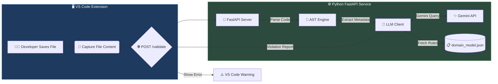

<div align="center">

# 🛡️ AI-Assisted Domain-Driven Design (DDD) Enforcer


---

### 🎓 SENG 472 — Term Project — Team 2

\*An intelligent **"Domain Guardian"** that prevents vibe coding by enforcing **Domain-Driven Design** principles in real-time using **Static Analysis (AST)** and **Large Language Models\***

[Features](#-features) • [Architecture](#-system-architecture) • [Installation](#-installation--setup) • [Usage](#-usage) • [Configuration](#%EF%B8%8F-configuration)

</div>

---

## 🎯 The Problem

> Modern software projects frequently suffer from **Domain Model Degradation** caused by:
>
> - 🔤 Ambiguous naming conventions
> - 🚧 Context boundary leakage
> - 📜 Architectural rule violations
> - 🤖 AI coding assistants generating inconsistent terminology

## 💡 The Solution

The **DDD Enforcer** acts as a **real-time DDD linter**, validating your code against precise architectural rules defined in `domain_model.json`.

<table>
<tr>
<td width="33%" align="center">

### 🧠 Static Analysis

AST-based code understanding without execution

</td>
<td width="33%" align="center">

### 🤖 LLM Intelligence

Google Gemini for contextual violation reports

</td>
<td width="33%" align="center">

### 🧩 IDE Integration

Real-time VS Code warnings as you type

</td>
</tr>
</table>

---

## ✨ Features

<table>
<tr>
<td>

### 🔍 Real-Time Validation

Runs automatically on **Ctrl + S** — instantly flags violations.

</td>
<td>

### 🧠 Hybrid Architecture

Lightweight VS Code Extension + powerful FastAPI backend for deep reasoning.

</td>
</tr>
<tr>
<td>

### 🧬 Smart AST Parsing

Extracts classes, imports, and names safely using Python AST (fully sandboxed).

</td>
<td>

### 🤖 AI-Powered Feedback

Gemini AI provides human-like explanations and actionable suggestions.

</td>
</tr>
<tr>
<td>

### 🚧 Boundary Enforcement

Detects illegal cross-context imports (e.g., `Sales → Inventory`).

</td>
<td>

### 📝 Customizable Rules

Powered entirely by `domain_model.json` — adaptable to any DDD project.

</td>
</tr>
</table>

---

## 🏗️ System Architecture



---

## 🚀 Installation & Setup

### 📋 Prerequisites

| Requirement   | Version    | Purpose         |
| ------------- | ---------- | --------------- |
| 🐍 Python     | 3.10+      | Backend runtime |
| 📦 Node.js    | Latest LTS | Extension build |
| 💻 VS Code    | Latest     | IDE integration |
| 🔑 Gemini API | -          | AI analysis     |

---

### 1️⃣ Backend Setup (The Brain 🧠)

```bash
# Navigate to backend directory
cd backend

# Create and activate virtual environment
python3 -m venv venv
source venv/bin/activate

# Install dependencies
pip install -r requirements.txt

# Configure your API key
echo "GEMINI_API_KEY=your_api_key_here" > .env

# Launch the server 🚀
uvicorn main:app --reload
```

<details>
<summary>📌 <b>Verify Installation</b></summary>

```bash
# Test the API endpoint
curl http://localhost:8000/health

# Expected response: {"status": "healthy"}
```

</details>

---

### 2️⃣ VS Code Extension Setup (The Interface 🎨)

```bash
# Navigate to extension directory
cd extension

# Install dependencies
npm install

# Compile TypeScript
npm run compile
```

> **💡 Tip:** Press `F5` inside VS Code to launch the extension in debug mode!

---

## 💻 Usage

### Example Violation

Write this code:

```python
class ClientManager:
    pass
```

### VS Code Shows:

<div align="center">

```
┌─────────────────────────────────────────────────────────────┐
│  ⚠️  DDD Violation                                          │
├─────────────────────────────────────────────────────────────┤
│  The term "Client" is a forbidden synonym.                  │
│                                                             │
│  💡 Suggestion: Use Customer instead.                       │
│                                                             │
│  📖 Rule: SalesContext.ubiquitous_language.entities[0]      │
└─────────────────────────────────────────────────────────────┘
```

</div>

---

## ⚙️ Configuration

### 📄 `domain_model.json` Structure

```json
{
  "bounded_contexts": [
    {
      "context_name": "SalesContext",
      "ubiquitous_language": {
        "entities": [
          {
            "name": "Customer",
            "synonyms_to_avoid": ["Client", "Buyer"],
            "description": "A person or organization that purchases products"
          }
        ],
        "value_objects": [
          {
            "name": "Money",
            "synonyms_to_avoid": ["Amount", "Price"]
          }
        ]
      },
      "allowed_dependencies": ["SharedKernel"]
    }
  ],
  "global_rules": {
    "banned_global_terms": ["Manager", "Util", "Helper", "Data"],
    "naming_conventions": {
      "entities": "PascalCase",
      "value_objects": "PascalCase"
    }
  }
}
```

---

## 📁 Project Structure

```
DDD-Enforcer/
│
├── 🐍 backend/
│   ├── 📂 core/
│   │   ├── __init__.py
│   │   ├── llm_client.py      # Gemini API integration
│   │   └── parser.py          # AST parsing engine
│   │
│   ├── 📂 domain/
│   │   ├── __init__.py
│   │   └── model.json         # DDD rules configuration
│   │
│   ├── 📂 services/           # Business logic services
│   ├── 📂 tests/              # Unit & integration tests
│   │
│   ├── main.py                # FastAPI entry point
│   └── requirements.txt       # Python dependencies
│
├── 🧩 extension/
│   ├── 📂 src/
│   │   ├── extension.ts       # Extension entry point
│   │   └── test/              # Extension tests
│   │
│   ├── package.json           # Extension manifest
│   └── tsconfig.json          # TypeScript config
│
└── 📖 README.md
```

---

## 🔮 Roadmap

- [ ] 📊 **Analytics Dashboard** — Track team DDD compliance over time
- [ ] 🌐 **Multi-Language Support** — Java, C#, Go parsing
- [ ] 📝 **Auto-Fix Suggestions** — One-click refactoring

---

## 👥 Team Members

<div align="center">

|  |  |
| :----------------------------------------------------------------------------------------------------------: | :-------------------------------------------------------------------------------------------------------------: |
|                                                **Ali Kendir**                                                |                                            **Ahmet Baran Dinçoğuz**                                             |
|                                                  Developer                                                   |                                                    Developer                                                    |

</div>

---

## 🤝 Contributing

Contributions are welcome! Please feel free to submit a Pull Request.

1. Fork the repository
2. Create your feature branch (`git checkout -b feature/AmazingFeature`)
3. Commit your changes (`git commit -m 'Add some AmazingFeature'`)
4. Push to the branch (`git push origin feature/AmazingFeature`)
5. Open a Pull Request

---

## 📜 License

<div align="center">

**Academic Use** — SENG 472 Term Project

_Extend and modify as needed for educational purposes._

---

</div>
