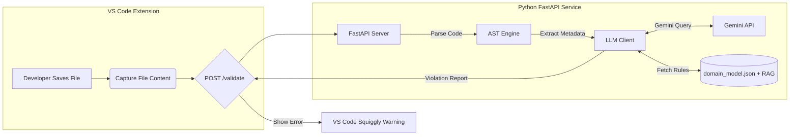

# 🛡️ AI-Assisted Domain-Driven Design (DDD) Enforcer

### _SENG 472 -- Term Project --- Team 2_

An intelligent **"Domain Guardian"** that prevents _vibe coding_ by
enforcing **Domain-Driven Design (DDD)** principles in real-time using
**Static Analysis (AST)** and **Large Language Models (Gemini 1.5)**.

---

## 📖 Overview

Modern software projects frequently suffer from **Domain Model
Degradation** caused by ambiguous names, context leakage, architectural
rule violations, or AI coding assistants generating inconsistent
terminology.

The **DDD Enforcer** solves this by acting as a **real-time DDD
linter**, validating your code against precise architectural rules
defined in `domain_model.json`.

It uses:

- 🧠 **Static Analysis (AST)** --- to understand your code without
  executing it\
- 🤖 **Google Gemini LLM** --- to generate natural, contextual
  violation reports\
- 🧩 **VS Code Extension** --- to show warnings inline as you type

Perfect for ensuring teams stick to **Ubiquitous Language**, **Bounded
Contexts**, and **Clean DDD boundaries**.

---

## ✨ Features

### 🔍 Real-Time Validation

Runs automatically when you hit **Ctrl + S** --- instantly flags
violations.

### 🧠 Hybrid Architecture

Lightweight VS Code Extension communicates with a FastAPI backend for
deep reasoning.

### 🧬 AST-Based Smart Parsing

Extracts classes, imports, and names safely using Python AST (no
execution, fully sandboxed).

### 🤖 AI-Powered Feedback

Gemini AI analyzes violations and provides human-like explanations and
suggestions.

### 🚧 Strict Boundary Enforcement

Detects illegal cross-context imports (e.g.,
`SalesContext → InventoryContext`).

### 📝 Customizable Rule Engine

Powered entirely by `domain_model.json`, making it adaptable to any DDD
project.

---

## 🏗️ System Architecture



---

## 🚀 Installation & Setup

### ✔️ Prerequisites

- Python **3.10+**
- Node.js & npm
- VS Code
- Google Gemini API key

---

# 1️⃣ Backend Setup (The Brain)

```bash
cd backend
python3 -m venv venv
source venv/bin/activate
pip install -r requirements.txt
echo "GEMINI_API_KEY=your_api_key_here" > .env
uvicorn main:app --reload
```

---

# 2️⃣ VS Code Extension Setup (The Interface)

```bash
cd extension
npm install
npm run compile
# Press F5 inside VS Code
```

---

## 💻 Usage

Example violation:

```python
class ClientManager:
    pass
```

VS Code displays:

> **\[DDD Violation\]**\
> The term "Client" is a forbidden synonym.\
> Suggestion: Use **Customer** instead.

---

## ⚙️ Configuration

Example `domain_model.json`:

```json
{
  "bounded_contexts": [
    {
      "context_name": "SalesContext",
      "ubiquitous_language": {
        "entities": [
          {
            "name": "Customer",
            "synonyms_to_avoid": ["Client", "Buyer"]
          }
        ]
      }
    }
  ],
  "global_rules": {
    "banned_global_terms": ["Manager", "Util"]
  }
}
```

---

## 🛠️ Project Structure

    DDD-Enforcer/
    ├── backend/
    │   ├── core/
    │   ├── domain/
    │   ├── knowledge/
    │   ├── main.py
    │   └── requirements.txt
    ├── extension/
    │   ├── src/
    │   ├── package.json
    │   └── tsconfig.json
    └── README.md

---

## 👥 Team Members --- _Team 2_

- **Ali Kendir**\
- **Ahmet Baran Dinçoğuz**

---

## 📌 License

Academic use --- extend as needed.
