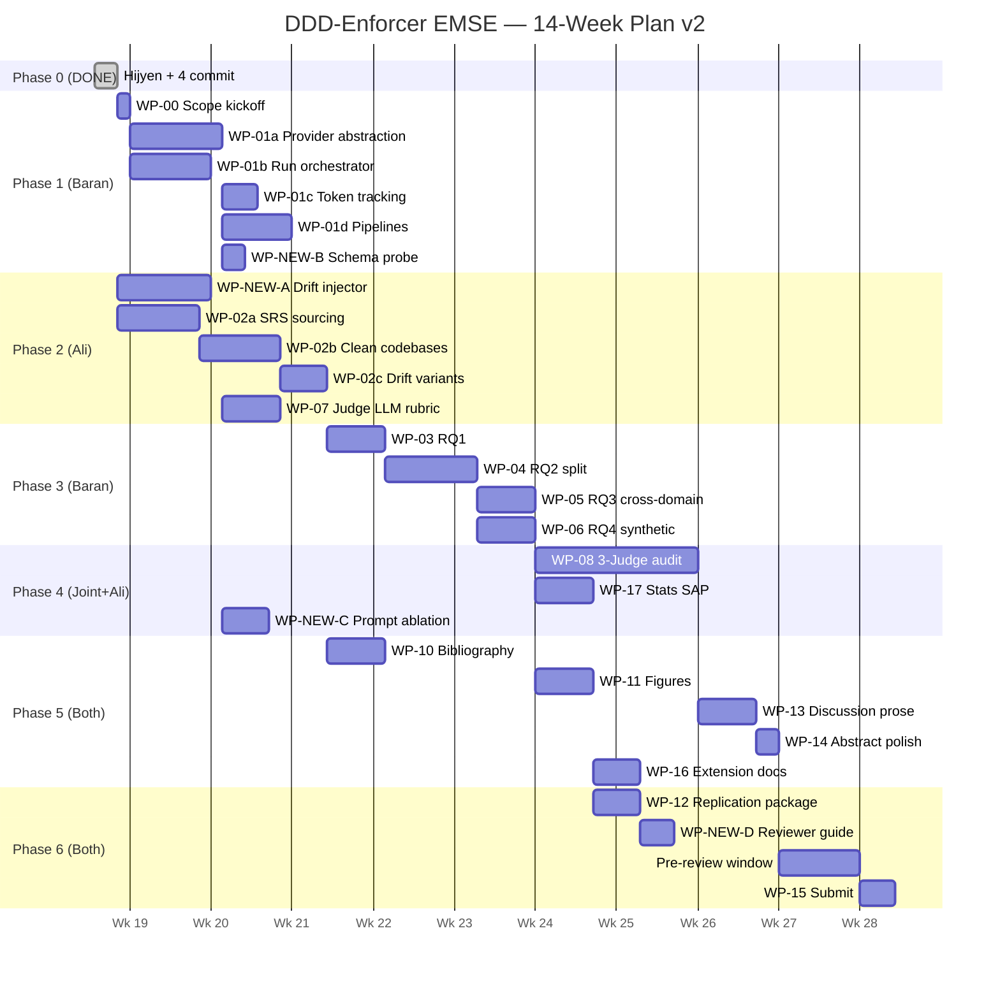

# DDD-Enforcer EMSE Submission — Work Package Index

> **Bu dosya status board'dur. Detaylı içerik için**: `todos/MASTER_PLAN.md` (canonical roadmap), `todos/AGENT_QUICKSTART.md` (entry point), `todos/WP_DAGILIM_BARAN_ALI.md` (ownership).
>
> **Last updated**: 2026-05-21 v3 (WP-01a + WP-NEW-B Stage 1 + WP-CORE-1 shipped)

---

## 0. Snapshot

- **Yazarlar**: Baran Dincoguz + Ali Kendir + Prof. Dr. Murat Karakaya (supervisor, no WP ownership)
- **Hedef**: Springer EMSE regular track, Ağustos-Eylül 2026 submission
- **Toplam aktif WP**: **23** (was 22; +3 new, -2 dropped) + **WP-CORE-1** unplanned (typed pipeline hardening, shipped)
- **Faz 0**: ✅ DONE (4 commit on main: 4a893c8, 2609001, 696188d, 56919da)
- **Faz 1**: WP-01a ✅, WP-NEW-B Stage 1 ✅, WP-CORE-1 ✅ — kalan: WP-00, WP-01b, WP-01c, WP-01d
- **Sıradaki adım**: WP-01b run-spec orchestrator (Baran) veya WP-NEW-B Stage 2 paper render

---

## 1. Locked Decisions Cheat Sheet

| # | Konu | Final |
|---|------|-------|
| **D1** | 6 model | G1 gemini-3.1-pro-preview · G2 gemini-3.1-flash-lite · O1 gpt-oss:120b · O2 qwen3-coder-next · O3 minimax-m2 · O4 gemma4:31b |
| **D2** | 3 sektör + Yaklaşım F | D1 e-ticaret + D2 banking + D3 healthcare; her domain CLEAN+DRIFT-LIGHT+DRIFT-HEAVY |
| **D3** | 3-rater Fleiss's κ | Baran + Ali + TEDU external; ~150 stratified verdict |
| **D4** | N=10 baseline | Hafta 4 pilot variance gate |
| **D5** | Refactor close-out | DONE (P0-D) |
| **D6** | RQ5 silindi | Reviewer'a bahsedilmez; Murat Hoca courtesy |
| **D7** | Security false alarm | .env hiç git'te değildi |

**RQ yapısı**: 4 ana (RQ1, RQ2, RQ3, RQ4), 6 alt (RQ2a/b/c sub-split). Detay: MASTER_PLAN.md §4.

**Yeni metrik**: `json_failed_rate` (Tablo 7 yeni kolon).

---

## 2. WP Status Board

Status legend: `[ ]` TODO · `[~]` IN_PROGRESS · `[!]` BLOCKED · `[x]` DONE · `[X]` DROPPED

### Faz 0 — Hijyen ✅ DONE

- [x] **P0-A** .env / git history audit (false alarm — hiç tracked olmamış)
- [x] **P0-B** Python 3.12 pin + requirements truncation fix + lock file
- [x] **P0-C** CI tests enabled + coverage %60 gate (actual %67) + pyright + integration marker + conftest
- [x] **P0-D** AST/parser refactor close-out (verified: facades clean, no TODOs, tests green)

### Faz 1 — Çekirdek Altyapı (W2-4)

- [ ] **WP-00** Scope lock (`configs/scope.yaml`, 6 model + N=10 + 3 domain) — owner: Joint — depends-on: [] — effort: S
- [x] **WP-01a** Provider abstraction (`core/llm/` paketi, 9-commit TDD big-bang) — owner: Baran — depends-on: [WP-00] — effort: M — Hoca: 1 (enables RQ2) — **SHIPPED 2026-05-19** (commits b627505..e380983, see [[WP-01a-provider-abstraction]] backfill in `development_docs/`)
- [ ] **WP-01b** Run-spec orchestrator (idempotent worker + YAML manifest) — owner: Baran — depends-on: [WP-00] — effort: M — Hoca: 1, 6
- [ ] **WP-01c** Token tracking + json_failed metric (6-model normalization) — owner: Baran — depends-on: [WP-01a] — effort: S — Hoca: 1
- [ ] **WP-01d** P1/P2/P3 pipeline classes — owner: Baran — depends-on: [WP-01a, WP-01b, WP-01c] — effort: M — Hoca: 1
- [~] **WP-NEW-B** Schema-Conformance Probe (6 model × 3 schema smoke) — owner: Baran — depends-on: [WP-01a] — effort: S — **Stage 1 SHIPPED 2026-05-19** (6×3 real probe, `runs/probe-20260519-175042.{json,manifest.json}`, see `development_docs/WP-NEW-B-Stage-1-schema-probe.md`); **Stage 2 TODO** (markdown table generator → Tablo 7 appendix)
- [x] **WP-CORE-1** Typed pipeline contracts + deterministic Synthesizer (unplanned hardening) — owner: Baran — depends-on: [WP-01a] — effort: M — **SHIPPED 2026-05-20** (14 commits, `be85ca4..352ac4b`, see `development_docs/WP-CORE-1-typed-pipeline.md`). Fixed live FM-CRASH; pipeline now runs E2E on D1 SRS.

### Faz 2 — Veri + Eval Altyapısı (W3-5, paralel)

- [ ] **WP-02** Subject corpus (3 domain × 3 codebase variant + sourcing) — owner: Ali — depends-on: [WP-00] — effort: L — Hoca: 1
  - 02a: D2/D3 public SRS sourcing (GitHub topic search + license)
  - 02b: D1 publish + 3 domain CLEAN codebase üretimi
  - 02c: DRIFT-LIGHT/HEAVY varyantları (NEW-A çıktısı)
- [ ] **WP-NEW-A** AST Drift Injector (V1-V6 quota tool, pure Python) — owner: Ali — depends-on: [] — effort: M
- [ ] **WP-07** Judge LLM rubric + cross-family selection — owner: Baran — depends-on: [WP-01a, WP-00] — effort: S — Hoca: 6

### Faz 3 — RQ Yürütme (W5-9)

- [ ] **WP-03** RQ1 (P1/P2/P3 precision-on-clean + recall-on-drift) — owner: Baran — depends-on: [WP-01d, WP-02, WP-07] — effort: S — Hoca: 1
- [ ] **WP-04** RQ2 split (a/b/c) + 6 model + json_failed kolon — owner: Baran — depends-on: [WP-03 winner] — effort: M — Hoca: 1
- [ ] **WP-05** RQ3 cross-domain × 3 drift level — owner: Baran — depends-on: [WP-04 winner config] — effort: S — Hoca: 1
- [ ] **WP-06** RQ4 synthetic seeded (drift injector kullanır) — owner: Baran — depends-on: [WP-04, WP-NEW-A] — effort: S

### Faz 4 — Validasyon + İstatistik (W8-11, paralel)

- [ ] **WP-08** 3-Judge Audit + Fleiss's κ + calibration session — owner: **Joint** (Baran + Ali + TEDU external) — depends-on: [WP-07, WP-03..06] — effort: M — Hoca: 6
- [ ] **WP-17** Pre-registered SAP + power analysis + pilot gate — owner: Ali — depends-on: [WP-01b, WP-03..06] — effort: M — Hoca: 6
- [ ] **WP-NEW-C** Prompt Sensitivity Ablation (3 prompt variant × pipeline) — owner: Ali — depends-on: [WP-01a] — effort: S

### Faz 5 — Yazım (W10-13)

- [ ] **WP-10** Bibliography (verify + 8+ yeni ref) — owner: Ali — depends-on: [Phase 1.2 literature shortlist] — effort: M — Hoca: 3
- [ ] **WP-11** Figures (4 vector PDF, RQ2 6-model Pareto) — owner: Ali — depends-on: [WP-04, WP-06, WP-16 specs] — effort: M — Hoca: 4
- [ ] **WP-13** Discussion + threats prose (RQ5 cleanup, RQ2a/b/c sub-narratives, json_failed analizi) — owner: Baran — depends-on: [WP-03..06, WP-08, WP-17] — effort: M — Hoca: 1, 2, 6
- [ ] **WP-14** Abstract + conclusion polish (numerically grounded) — owner: Ali — depends-on: [WP-13] — effort: S — Hoca: 2
- [ ] **WP-16** Extension architecture documentation — owner: Ali — depends-on: [WP-11 coordination] — effort: M — Hoca: 4

### Faz 6 — Replication + Submission (W13-15)

- [ ] **WP-12** Replication package + Zenodo DOI + GitHub release tag — owner: Baran — depends-on: [WP-03..06] — effort: S — EMSE Open Science
- [ ] **WP-NEW-D** Reviewer/Evaluator Guide (`EVALUATION.md`, 30-dk artifact-eval recipe) — owner: Ali — depends-on: [WP-12] — effort: S
- [ ] **WP-15** Submission package (cover letter + reviewers + EM portal) — owner: **Joint** — depends-on: [all WPs] — effort: S

### DROPPED

- [X] ~~**WP-09**~~ Practitioner Survey — D6 nedeniyle (RQ5 ile bağlantılı)
- [X] ~~**WP-18**~~ RQ5 Design + Execution — D6 silme

---

## 3. Hoca Feedback × WP Mapping

| Hoca tag | Note | Primary WPs | Secondary WPs |
|----------|------|-------------|---------------|
| **Hoca-1** | N/M/K boş | WP-00, WP-01b, WP-17 | WP-02, WP-04 |
| **Hoca-2** | Abstract sonuç boş | WP-14 | WP-13, WP-17 |
| **Hoca-3** | Related work tamamla | WP-10 | Phase 1.2 literature, WP-13 |
| **Hoca-4** | Mimari + extension workflow | WP-11, WP-16 | WP-13 |
| **Hoca-5** | RQ5 yapılacak | ❌ DROPPED (D6) | Murat Hoca courtesy bilgilendirilir |
| **Hoca-6** | Threats: run/varyant/power | WP-17, WP-08 | WP-13 |

---

## 4. Critical-Path Mermaid (14 hafta)

---

## 5. Risks & Critical Blockers

**4 Critical Blocker** (audit'ten):
1. WP-NEW-A AST Drift Injector — yoksa Faz 2 chokepoint
2. WP-08 3-Judge Setup — TEDU external Hoca recruitment Hafta 1'de başlamalı
3. WP-17 N pilot gate (Hafta 4) — RQ batch'leri yanlış N ile koşmasın
4. RQ5 silinme cleanup — eski WP referansları temizlendi ✅

**Risk register**: Detay `WP_DAGILIM_BARAN_ALI.md` Risk Matrisi'nde.

---

## 6. Çalışma Anlaşması

1. **No `\placeholder{...}` ships in submission** — Her placeholder bir WP'ye bağlı veya silinmiş
2. **Numerical results auto-flow** — `scripts/build_tables.py` tüm RQ tablolarını `runs/`'tan render eder, manuel cell editing yasak
3. **Reproducibility** — Her experiment için `make rq<N>` target; CI'da smoke
4. **TDD** — Test önce, kırmızı, sonra implementation
5. **Atomic commits** — Her commit yeşil-CI, rollback mümkün; Conventional Commits format
6. **Branch strategy** — `main` her zaman yeşil; feature work `wp-XX-*` veya `feature/wp-XX-*` branch'inde
7. **PR review** — Her commit/PR karşı yazar review eder
8. **Internal pre-review** — Submission'dan 1 hafta önce zorunlu gate
9. **HOCA_GUNDEM.md** — Hoca konuşması öncesi açık konular buraya eklenir
10. **Sync points** — `HANDOFF_S{1..7}.md` template (W4, W5, W7, W9, W10-11, W11, W13)

---

**Last reviewed**: 2026-05-21 (WP-01a + WP-NEW-B Stage 1 + WP-CORE-1 shipped sync)
**Next review**: After WP-01b run-spec orchestrator kickoff
