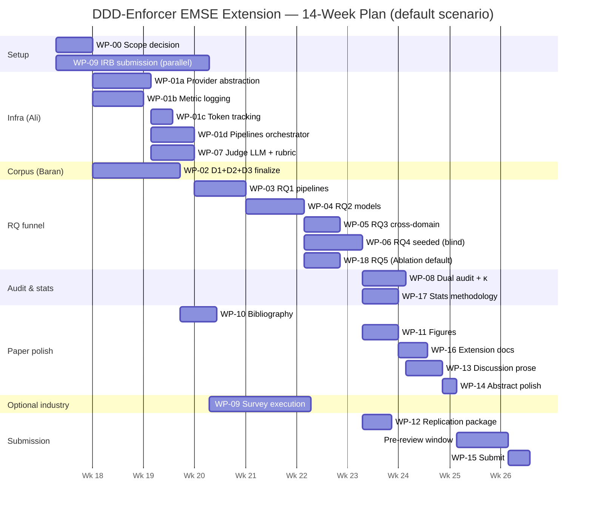

# DDD-Enforcer EMSE Submission — Work Package Index

**Date:** 2026-04-27
**Target venue:** Springer *Empirical Software Engineering* (Q1, IF 3.6, ~24-day median first-decision).
**Team:** **Baran Dincoguz** + **Ali Kendir** (co-authors), **Prof. Dr. Murat Karakaya** (advisor — review-only, not assigned as Owner on any WP).
**Total estimated effort:** **12–16 weeks** (realistic default: 14 weeks).
**This file is the single source of truth for status.** Every other planning document points back here.

## Companion planning files

| File | Purpose |
|------|---------|
| `00-context-report.md` | Subagent-produced repo inventory; refutes most "infrastructure missing" assumptions |
| `00-paper-baseline.md` | Every `\placeholder{...}` in `paper.tex` mapped + categorized + line-numbered |
| `00-instructor-feedback-mapping.md` | Hoca's 6 notes → WPs (this is your "what does Hoca want me to fix?" lookup) |
| `01-brainstorming.md` | Gap statement, 9 reviewer-threat scenarios, RQ5 decision matrix |
| `01-risks.md` | 10 ranked risks with quantitative impact + triggers + mitigations |
| `02-literature.md` | Memory-recall literature shortlist; **every entry must be verified before BibTeX migration in WP-10** |

---

## 1. Hoca-feedback × Work Package mapping

| Hoca tag | Note | Primary WPs | Secondary WPs |
|----------|------|-------------|---------------|
| **Hoca-1** | N proje / M model boş | **WP-00, WP-01b, WP-17** | WP-02, WP-04 |
| **Hoca-2** | Abstract sonuç boş | **WP-14** | WP-13, WP-17 |
| **Hoca-3** | Related work tamamla | **WP-10** | Phase 1.2 literature, WP-13 |
| **Hoca-4** | Mimari + extension workflow | **WP-11, WP-16** | WP-13 |
| **Hoca-5** | RQ5 yapılacak | **WP-18** | WP-13, WP-14 |
| **Hoca-6** | Threats: run/varyant/power | **WP-17** | WP-13, WP-08 |

---

## 2. Work Package list

Status legend: `[ ]` TODO · `[~]` IN_PROGRESS · `[!]` BLOCKED · `[x]` DONE

### Tier 0 — Scope decision (week 1)

- [ ] **WP-00** Scope definition — owner: Baran+Ali joint — depends-on: [] — effort: S — Hoca: 1

### Tier 1 — Infrastructure refactor (weeks 1–4, parallelizable)

- [ ] **WP-01a** Provider abstraction layer — owner: Ali — depends-on: [WP-00] — effort: M — Hoca: 1 (enables RQ2)
- [ ] **WP-01b** Metric logging + run manifest — owner: Ali — depends-on: [WP-00] — effort: M — Hoca: 1, 6
- [ ] **WP-01c** Token tracking + cost telemetry — owner: Ali — depends-on: [WP-01a] — effort: S — Hoca: 1
- [ ] **WP-01d** Pipeline implementations (P1, P2, P3) + multi-run orchestrator — owner: Ali — depends-on: [WP-01a, WP-01b, WP-01c] — effort: M — Hoca: 1
- [ ] **WP-02** Subject corpus (D1, D2, D3) finalize — owner: Baran (data + writing) — depends-on: [WP-00] — effort: M — Hoca: 1

### Tier 2 — Evaluation harness (weeks 4–6)

- [ ] **WP-07** Judge LLM + rubric pipeline — owner: Ali — depends-on: [WP-01a, WP-00] — effort: M — Hoca: 6

### Tier 3 — RQ experiments (weeks 5–10, mostly serialized through the funnel)

- [ ] **WP-03** RQ1 pipeline comparison — owner: Ali (run) + Baran (analysis) — depends-on: [WP-01d, WP-02, WP-07] — effort: M — Hoca: 1
- [!] **WP-04** RQ2 LLM provider comparison — owner: Ali — depends-on: [WP-03 (winner)] — effort: L — Hoca: 1
- [!] **WP-05** RQ3 cross-domain — owner: Ali + Baran — depends-on: [WP-04 (winner config)] — effort: M — Hoca: 1
- [!] **WP-06** RQ4 synthetic violations (blind injection) — owner: Author A injects (Baran) + Author B runs (Ali) — depends-on: [WP-04] — effort: L — Hoca: 1
- [!] **WP-18** RQ5 design + execution — owner: Ali (Ablation) OR Baran (Dev Study) — depends-on: [WP-04 + (WP-09 if Dev Study)] — effort: M (Ablation) / L (Dev Study) — Hoca: 5

### Tier 4 — Audit & statistics (weeks 9–12)

- [!] **WP-08** Author audit + Cohen's κ — owner: Baran AND Ali (dual independent) — depends-on: [WP-07, WP-03..06] — effort: M — Hoca: 6
- [!] **WP-17** Statistical methodology — owner: Ali (impl) + Baran (writing) — depends-on: [WP-01b, WP-03..06] — effort: M — Hoca: 6

### Tier 5 — Paper polish (weeks 11–14, parallelizable)

- [ ] **WP-10** Bibliography + placeholder cleanup — owner: Baran — depends-on: [Phase 1.2 literature shortlist] — effort: M — Hoca: 3
- [ ] **WP-11** Figures + diagrams — owner: Baran (Fig 1, 4) + Ali (Fig 2, 3 scripts) — depends-on: [WP-04, WP-06, WP-16 specs] — effort: M — Hoca: 4
- [ ] **WP-13** Discussion + threats prose — owner: Baran + Ali — depends-on: [WP-03..06, WP-08, WP-17, WP-18] — effort: M — Hoca: 1, 2, 6
- [ ] **WP-14** Abstract + conclusion polish — owner: Baran — depends-on: [WP-13] — effort: S — Hoca: 2
- [ ] **WP-16** Extension architecture documentation — owner: Baran (writing) + Ali (screenshots) — depends-on: [WP-11 coordination] — effort: M — Hoca: 4

### Tier 6 — Optional industry track (parallelized from week 1)

- [ ] **WP-09** Practitioner survey — owner: Baran — depends-on: [WP-00] (concurrent w/ infra) — effort: L — Hoca: B.6 reviewer threat
  - Decision gate: if RQ5 = (D) Developer Study, this WP merges into WP-18.

### Tier 7 — Submission gate (weeks 14–16)

- [ ] **WP-12** Replication package (Zenodo + GitHub release) — owner: Ali — depends-on: [WP-03..06] — effort: S — EMSE Open Science
- [ ] **WP-15** Submission package (cover letter + reviewers + EM portal) — owner: Baran (letter) + Ali (compile dry-run) — depends-on: [all WPs] — effort: S — N/A

---

## 3. Owner distribution proposal

**Suggestion only** — Baran/Ali to confirm or rebalance:

| Author | WPs (primary owner) |
|--------|---------------------|
| **Ali (infrastructure-heavy)** | WP-01a, WP-01b, WP-01c, WP-01d, WP-04, WP-07, WP-12 |
| **Baran (writing + literature + corpus)** | WP-02, WP-09, WP-10, WP-11 (Fig 1, 4), WP-14, WP-16 |
| **Joint** | WP-00 (decision), WP-03 (run+analysis), WP-05 (cross-domain), WP-06 (blind A/B), WP-08 (dual audit), WP-13 (prose), WP-15 (submission), WP-17 (impl+writing), WP-18 (depends on RQ5 choice) |

**Workload check:** Ali has 7 primary WPs (mostly tooling); Baran has 6 primary WPs (mostly writing); 9 are joint. Roughly balanced when joint WPs are split per task.

---

## 4. Critical-path Mermaid Gantt (14-week realistic plan)

(Mermaid renders in GitHub, GitLab, Obsidian, mermaid.live. If your viewer doesn't render Mermaid, paste the source there.)

---

## 5. Recommended starting sequence (week 1)

1. **WP-00** scope decision meeting (Baran + Ali + Hoca) — 1–2 hours, then commits `configs/scope.yaml`.
2. **Submit IRB application for WP-09** (Baran) — even if WP-09 stays optional; the 3-week IRB clock starts immediately.
3. **WP-01a smoke-test 4 providers** (Ali) — 1 file × 1 violation × 4 providers — surfaces structured-output issues *now*, not week 7.
4. **WP-10 sub-task: arXiv ID forensics for `automatingddd2024`** (Baran) — 30 minutes; close the most embarrassing single bug in the bibliography.
5. **Schedule 4 Hoca review gates** (Baran) for: end of week 1 (Phase 0 + WP-00 sign-off), end of week 8 (RQ1+RQ2 done), end of week 13 (full prose draft), end of week 14 (pre-submit final).

---

## 6. RQ5 decision (awaiting Baran)

Three favorites, ranked:

| Rank | Option | Effort | EMSE-fit | Why |
|------|--------|--------|----------|-----|
| 🥇 | **(A) Ablation: AST removed** | M | 4/5 | Reuses RQ1–4 dataset; defends architecture claim |
| 🥈 | **(D) Developer study** | L | 5/5 | Strongest industry-relevance signal; IRB-bounded |
| 🥉 | (C) Rulebook stability | S | 3/5 | Cheap, but better as §9.3 sub-paragraph |

**Default recommendation (Claude):** RQ5 = (A) Ablation. **If team capacity allows:** add WP-09 as appendix-(D) (industry signal without scope creep) — *do not* promote to RQ6 unless tightly scoped.

See `01-brainstorming.md` §C for full reasoning.

---

## 7. Total estimated effort

- **Optimistic:** 11 weeks (no IRB, RQ5=(A) only, all green).
- **Realistic (default):** **14 weeks**.
- **Pessimistic:** 16–18 weeks (one major slip + Hoca review delay + IRB extension).

Track cumulative slip in this file's commit history; escalate to a re-plan if any single WP slips >3 days past its planned end.

---

## 8. Working agreement

(From the original prompt, restated here for visibility.)

1. **No `\placeholder{...}` ships in submission.** Every placeholder is bound to a WP or deleted with prose adjusted.
2. **Numerical results auto-flow** — `scripts/build_tables.py` renders all RQ tables from `runs/`. Manual cell editing forbidden.
3. **Reproducibility** — every experiment has a `make rq<N>` target; smoke tests in CI.
4. **Tone consistency** — "proof-of-concept", "framework", "today's capability level", "swappable" used uniformly. `docs/glossary.md` enforces vocabulary.
5. **Subagent usage encouraged** for: future literature passes, BibTeX migration, figure scripts, per-WP implementation work. Main thread does coordination + final review.
6. **Branch strategy:** `main` always compiles + tests pass; feature work on `wp-XX-*` branches.
7. **Commit message:** `WP-XX <short title>: <change summary>`.
8. **Internal pre-review** is a 1-week scheduled gate before submission, not optional.

---

**Last updated:** 2026-04-27 (initial generation)
**Next review:** After WP-00 sign-off (expected end of week 1).
